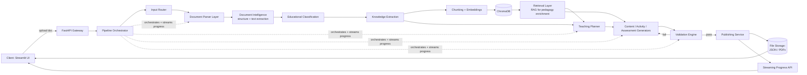
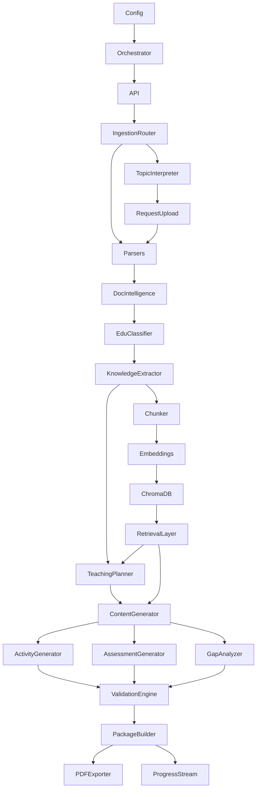
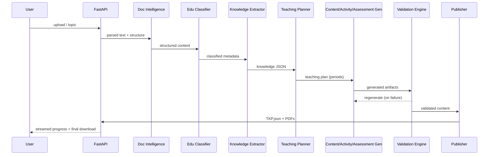

# PROJECT_ROADMAP.md

**Project:** Teacher Knowledge Package (TKP) Generation Platform
**Document Type:** Master Architecture Reference (Single Source of Truth)
**Audience:** Every future Claude conversation / any engineer continuing this project
**Status:** Locked — implementation must not drift from this document without an explicit, recorded amendment
**Source of Truth Documents:** IIT Mandi AI Engineer Assignment, IIT Mandi FAQ (both referenced throughout; do not contradict them)

---

## 0. How to Use This Document

This is the **only** document a future Claude session needs to resume work on this project. It is organized into four locked development phases. Each phase is self-contained: objective, scope, modules, inputs/outputs, deliverables, Definition of Done, git branch, commit milestones, dependencies, risks, estimated completion, and a handoff summary for the next phase.

**Rules for any future contributor (human or Claude):**
1. Do not add phases. Do not merge phases. Do not split phases.
2. Do not introduce features not traceable to the Assignment or FAQ. If it seems useful but isn't required, it goes in [§20 Future Improvements](#20-future-improvements) — never into MVP scope.
3. The tech stack in [§3](#3-tech-stack-locked) is locked. Do not substitute components.
4. If a phase's Definition of Done is not met, do not proceed to the next phase.
5. Total build budget is ~2 days. When in doubt, choose the simpler implementation that satisfies the Definition of Done.

---

## 1. Project Goal

Build an AI-powered platform that converts raw educational documents into a classroom-ready **Teacher Knowledge Package (TKP)**: a structured bundle of lesson plans, teacher guides, assessments, and supporting metadata, grounded in a primary source document. (An earlier draft of this goal also covered entering a bare topic name; see the §4 amendment — that input mode has since been removed entirely.)

This is **not** a chatbot and **not** a conversational assistant. It is a document-in, teaching-package-out pipeline that reasons like an experienced teacher preparing for class.

---

## 2. Core Philosophy

- The uploaded document is always the **Primary Knowledge Source (PKS)**. This is now the only input mode — see §4, amended.
- All factual/conceptual content in the output must be traceable to the PKS.
- External/secondary knowledge (LLM general knowledge, teaching-strategy references) may only be used to enrich **pedagogy** — analogies, activity design, motivational framing, assessment technique — never to introduce new facts, figures, or concepts absent from the PKS.
- The output structure is **adaptive**, not templated: number of periods, depth of explanation, and activity style scale with grade level, subject, and content complexity (per FAQ Q1, Q3).
- Architecture is modular: one responsibility per module, no monolithic prompts, no monolithic services.
- A multi-stage pipeline is used (per FAQ Q5) so each stage can be independently validated, retried, and streamed to the frontend.

---

## 3. Tech Stack (Locked)

| Layer | Choice |
|---|---|
| Language | Python |
| Backend Framework | FastAPI |
| LLM | Official Google Gemini SDK |
| Preferred Model | Gemini 2.5 Flash (or latest Flash-tier equivalent) |
| Orchestration Framework | LangChain |
| Vector Database | ChromaDB |
| Frontend | Streamlit |
| Deployment | Render |
| Configuration | python-dotenv |

**Explicitly excluded:** SQL database, authentication, login system, user accounts, any enterprise feature not directly required by the assignment.

---

## 4. Input Modes (Locked)

### Mode 1 — Document Upload (the only supported mode)
Teacher uploads PDF / DOCX / PPTX / TXT → Parsing → Pipeline.

> **Amendment (recorded, per §0 rule 1):** Automatic official-chapter retrieval
> (the original "Educational Content Resolver" / NCERT-first download workflow
> described in earlier drafts) is permanently out of scope. It was
> implemented, evaluated, and intentionally abandoned — see
> `PHASE_1_FINAL_CLEANUP.md` for the reasoning (NCERT's site exposes no
> chapter titles, only "Chapter N" links; reliable matching would require
> downloading every chapter first; subject-to-grade mappings are inconsistent;
> and browser automation/scraping added maintenance cost not justified by
> project scope).
>
> **Amendment 2 (recorded, per §0 rule 1):** Following on from Amendment 1,
> "Mode 2 — Topic Mode" (the free-text `/topic` endpoint and Topic Interpreter
> described in earlier drafts of this document) has itself now been fully
> removed from the codebase, not merely the automatic-retrieval part of it.
> After implementation and testing it was judged unnecessary complexity for
> a product that always requires an uploaded reference document before a
> teaching package can be generated. Document Upload (Mode 1 above) is the
> only input mode the product supports. Both amendments supersede any
> Topic Mode description that follows in this document wherever the two
> conflict; the rest of this document is retained as a historical planning
> record only.

### Optional Lightweight Clarification Step
Per FAQ Q5 and Q7, the system may ask a small number of clarifying questions at the start of the workflow:
- Target grade/audience (if not inferable)
- Teaching objectives / desired style
- Time constraints
- Document nature classification: *Mostly Text / Text with Tables / Text with Diagrams-Figures / Text with Equations / Scanned PDF / I'm Not Sure* — used for cost-aware parser routing.

This must stay lightweight — it is not a multi-turn conversation, it is a short pre-pipeline form.

---

## 5. Outputs

| Output | Description |
|---|---|
| `TeacherKnowledgePackage.json` | Master structured output — single source artifact for everything else |
| Teacher Guide | Human-readable teaching document |
| Lesson Plan | Period-by-period instructional plan |
| Assessment Book | MCQs, short/long answers, numericals, rubrics |
| Knowledge JSON | Extracted structured educational representation |
| Metadata | Subject, grade, difficulty, topic, chapter, category, language |
| Validation Report | Schema, grounding, hallucination, consistency check results |
| Progress Updates | Streamed `{stage, progress}` events during generation |

---

## 6. Overall System Architecture

Note (per §4 Amendment 2): Topic Mode / Mode 2 has been removed; the diagram
below is retained as historical planning context and should be read with
`Input Router` routing directly to `Document Parser Layer` (upload only).



**Suggested reference architecture from the assignment** (API Gateway ➔ Upload Service ➔ Document Intelligence ➔ Educational Classification ➔ Knowledge Extraction ➔ Teaching Planner ➔ Content/Activity/Assessment Generators ➔ Validation Engine ➔ Storage) maps directly onto the diagram above; FastAPI serves as both API Gateway and Upload Service given the 2-day scope. The **Pipeline Orchestrator** sits between the Gateway and every downstream stage — see §6.1.

### 6.1 Pipeline Orchestrator

A dedicated `PipelineOrchestrator` module is the central control point for a job, introduced to keep stage sequencing, retries, and progress reporting out of individual business-logic modules. Its responsibilities:

- Executing pipeline stages in the correct sequence for a given `job_id`.
- Passing each stage's output as the next stage's input (owns the inter-stage data contracts — see §14.1).
- Emitting progress events (`{stage, progress}`) to the Streaming Progress API as each stage starts/completes.
- Retry handling for transient failures (LLM timeouts, rate limits) per the Error Handling Strategy (§15).
- Validation routing: on a Validation Engine failure, the Orchestrator — not the generator modules themselves — decides whether to trigger targeted regeneration of a specific stage/period.
- Centralized pipeline control: it is the single place that knows "what stage are we on and what's next," so individual modules stay single-responsibility and stateless.

This does not change any stage's internal logic — it replaces what would otherwise be ad hoc sequencing scattered across API route handlers with one coordinating module.

---

## 7. Complete Folder Structure

```
teacher-ai-platform/
├── backend/
│   ├── main.py                       # FastAPI app entrypoint
│   ├── config.py                     # env/config loader (python-dotenv)
│   ├── orchestrator/
│   │   └── pipeline_orchestrator.py  # sequencing, retries, progress, validation routing
│   ├── api/
│   │   ├── routes_upload.py          # Mode 1 endpoints
│   │   ├── routes_topic.py           # Mode 2 endpoints
│   │   ├── routes_progress.py        # streaming progress SSE/WebSocket
│   │   └── routes_download.py        # download final artifacts
│   ├── ingestion/
│   │   ├── router.py                 # doc-type classification + routing
│   │   ├── parsers/
│   │   │   ├── pdf_parser.py         # PyMuPDF
│   │   │   ├── docx_parser.py        # python-docx
│   │   │   ├── ppt_parser.py         # python-pptx
│   │   │   └── txt_parser.py         # native text loader
│   │   └── topic_interpreter.py      # Mode 2: NLP-only grade/subject/topic extraction
│   ├── prompts/
│   │   ├── classification_prompt.md
│   │   ├── knowledge_extraction_prompt.md
│   │   ├── teaching_planner_prompt.md
│   │   ├── lesson_generation_prompt.md
│   │   ├── activity_generation_prompt.md
│   │   ├── assessment_generation_prompt.md
│   │   └── validation_prompt.md
│   ├── intelligence/
│   │   ├── document_intelligence.py  # structure detection
│   │   ├── educational_classifier.py # subject/grade/difficulty/topic
│   │   └── knowledge_extractor.py    # objectives, concepts, formulae, etc.
│   ├── retrieval/
│   │   ├── chunker.py
│   │   ├── embeddings.py
│   │   └── vector_store.py           # ChromaDB wrapper
│   ├── pedagogy/
│   │   ├── teaching_planner.py       # Stage 4
│   │   ├── content_generator.py      # Stage 5
│   │   ├── activity_generator.py     # Stage 6
│   │   ├── assessment_generator.py   # Stage 7
│   │   └── gap_analyzer.py           # Stage 8
│   ├── validation/
│   │   ├── schema_validator.py
│   │   ├── hallucination_detector.py
│   │   ├── grounding_validator.py
│   │   └── consistency_validator.py
│   ├── publishing/
│   │   ├── package_builder.py        # TeacherKnowledgePackage.json
│   │   ├── pdf_exporter.py           # Teacher Guide / Lesson Plan / Assessment Book
│   │   └── progress_stream.py
│   ├── models/
│   │   └── schemas.py                # Pydantic models shared across pipeline
│   └── logging_config.py
├── frontend/
│   ├── app.py                        # Streamlit entrypoint
│   ├── pages/
│   │   ├── 1_Upload.py
│   │   ├── 2_Topic_Mode.py
│   │   ├── 3_Progress.py
│   │   ├── 3b_Preview.py
│   │   └── 4_Downloads.py
│   └── components/
├── samples/
│   ├── sample_output_1_stem.json
│   └── sample_output_2_humanities.json
├── docs/
│   ├── PROJECT_ROADMAP.md            # this document
│   ├── architecture_diagram.png
│   └── README.md
├── .env.example
├── requirements.txt
└── render.yaml
```

### 7.1 Parser Implementation Reference (Locked)

| Format | Library |
|---|---|
| PDF | PyMuPDF |
| DOCX | python-docx |
| PPTX | python-pptx |
| TXT | Native text loader |
| Scanned PDF | Routed through an OCR-capable parser later, only if needed |

OCR is **optional for MVP**. The document router (`ingestion/router.py`), informed by the FAQ Q7 document-nature classification and/or automatic heuristics (embedded image ratio, extractable-text ratio), determines whether a given PDF requires OCR routing at all — most NCERT-style PDFs are text-extractable via PyMuPDF and never hit the OCR path.

---

## 8. Module Dependency Diagram



Note: `Orchestrator` is a cross-cutting dependency — every stage from `IngestionRouter` through `PackageBuilder` reports to and is sequenced by it (omitted from the remaining edges above for diagram readability; see §6.1 for its full responsibilities).

---

## 9. End-to-End Data Flow

1. Client submits document (Mode 1) or topic (Mode 2) via Streamlit → FastAPI.
2. Gateway assigns a `job_id`, opens a progress channel, routes based on mode.
3. Mode 2 passes the topic through the Topic Interpreter (NLP-only grade/subject/topic/confidence extraction), then requests a teacher upload; Mode 1 uses the uploaded file directly. From here both modes are identical.
4. Document classification (from FAQ Q7 clarification, or heuristic) selects the parser strategy.
5. Parser extracts structured text (headings, sections, tables, figures, equations, metadata).
6. Educational Classifier produces Subject/Grade/Difficulty/Topic/Chapter/Category/Language metadata.
7. Knowledge Extractor produces the structured Knowledge JSON (objectives, prerequisites, concepts, definitions, formulae, keywords, examples, applications, misconceptions).
8. Content is chunked and embedded into ChromaDB, enabling a retrieval layer used **only** to enrich pedagogy (analogies, activity ideas), never to add facts.
9. Teaching Planner determines number/length of periods and objectives per period.
10. Generators (Content, Activity, Assessment, Gap Analysis) run per period, grounded in the Knowledge JSON, optionally enriched via retrieval.
11. Validation Engine checks schema conformity, hallucination/grounding, and cross-period consistency. Failures trigger targeted regeneration of the specific stage/period, not the whole pipeline.
12. Publishing Service assembles `TeacherKnowledgePackage.json` and renders the Teacher Guide, Lesson Plan, and Assessment Book as PDFs.
13. Progress events are streamed throughout steps 4–12; final artifacts become downloadable.

---

## 10. AI Pipeline Flow



---

## 11. RAG Pipeline Flow

- **Purpose:** RAG is used strictly to *ground* pedagogy generation in the primary source and to surface teaching-enrichment context (analogies, activity patterns) — never to introduce new subject matter.
- **Indexing:** Primary source is chunked (semantic/heading-aware chunking) → embedded → stored in ChromaDB per `job_id` (isolated per-session collection; no cross-user leakage).
- **Retrieval:** At generation time, the relevant chunk(s) for the current concept/period are retrieved and passed into the generation prompt as grounding context alongside the Knowledge JSON.
- **Secondary enrichment (optional):** A curated, general pedagogy reference set (teaching strategies, learning-science patterns) may also be retrieved — but is explicitly labeled as "pedagogical enrichment," never merged with primary-source facts, per FAQ Q4.
- **Traceability (bonus):** Where feasible, retrieved chunk IDs are attached to generated content sections for citation, supporting the assignment's bonus "RAG & Traceability" criterion.

---

## 12. Prompt Flow

Each generation stage uses a **narrow, single-responsibility prompt** rather than one giant prompt (per project philosophy: avoid monolithic prompts).

| Stage | Prompt Responsibility | Grounding Input |
|---|---|---|
| Educational Classification | Classify subject/grade/difficulty/topic/language | Parsed document structure |
| Knowledge Extraction | Extract objectives/concepts/definitions/formulae/misconceptions | Classified document |
| Teaching Planner | Decide period count/length/sequencing | Knowledge JSON |
| Content Generator | Per-period teacher script, blackboard notes, entry/exit tickets | Knowledge JSON + RAG chunk for that period's concepts |
| Activity Generator | Design activities with materials/duration/success criteria | Same as above + pedagogy enrichment retrieval |
| Assessment Generator | MCQs/short/long/numerical + rubric | Knowledge JSON (objectives + concepts only) |
| Gap Analyzer | Misconceptions, diagnostics, remediation | Knowledge JSON's misconceptions list |
| Hallucination/Grounding Validator | Compare generated claims against Knowledge JSON / source chunks | All prior outputs + primary source |

All prompts explicitly instruct the model: *"Do not introduce facts, figures, or concepts not present in the provided source content. You may enrich teaching style, analogies, and activities only."*

### 12.1 Prompt Architecture

Prompts are treated as versioned artifacts, not inline strings. A dedicated `prompts/` folder (see §7) holds one Markdown template per module:

```
prompts/
├── classification_prompt.md
├── knowledge_extraction_prompt.md
├── teaching_planner_prompt.md
├── lesson_generation_prompt.md
├── activity_generation_prompt.md
├── assessment_generation_prompt.md
└── validation_prompt.md
```

Rules:
- Each module owns exactly one prompt template — no shared or catch-all prompt files.
- Prompt templates are never embedded inside business logic (`.py` files); modules load their template from `prompts/` and fill in variables, keeping prompt wording reviewable and editable independent of code changes.
- This mirrors the existing "avoid monolithic prompts" philosophy in §2 — the `prompts/` folder is the concrete implementation of that principle.

---

## 13. Retrieval Strategy

- One ChromaDB collection per `job_id`, discarded/archived after job completion (no persistent SQL, per locked stack).
- Chunking strategy: heading/section-aware where structure is detected; falls back to fixed-size overlapping chunks for unstructured text.
- Retrieval is not confined to a single stage — the vector store is a shared resource that multiple pipeline stages may query, each for a different purpose:

```
Document
   ↓
Chunking
   ↓
Embeddings
   ↓
ChromaDB
   ↓
Retriever
   ↓
Knowledge Extraction   (retrieves supporting passages while extracting concepts/definitions/formulae)
   ↓
Teaching Planner       (retrieves content-volume/complexity signals to inform period count/length)
   ↓
Lesson Generator       (retrieves period-specific chunks + pedagogy-enrichment context)
   ↓
Validation             (retrieve-then-verify grounding/hallucination checks)
```

- Concretely, this means: Knowledge Extraction, Teaching Planner, the Content/Activity/Assessment Generators, and Validation may all call the Retrieval Layer — it is not exclusive to Lesson Generation as earlier phrasing implied.
- Regardless of which stage calls it, the same rule from §2 and §11 applies: retrieval may only ground or enrich pedagogy — it never becomes a channel for introducing facts absent from the primary source.

---

## 14. Validation Strategy

| Check | What It Verifies |
|---|---|
| Schema Validation | Every generated JSON object conforms to the Pydantic schema for that stage |
| Grounding Validation | Every factual claim in generated content maps to a passage in the primary source (via retrieval match) |
| Hallucination Detection | Flags claims that cannot be matched to the primary source or its extracted Knowledge JSON — per FAQ Q4, this is the operative definition of "hallucination" for this project |
| Consistency Validation | Objectives/concepts referenced across periods don't contradict each other; period sequencing is logically ordered |
| Missing-Field Check | Required objectives/concepts/sections are all present |

On failure, the Validation Engine returns a structured report identifying the failing stage/period, which triggers a targeted regeneration (not a full pipeline restart).

### 14.1 Core Data Contracts

These are the shared JSON models (Pydantic, in `models/schemas.py`) that pass between stages. This section defines each model's **responsibility and relationships only** — full field-level schemas are an implementation detail decided during Phase 1/2 build-out, not fixed here.

| Model | Responsibility | Relationship |
|---|---|---|
| `DocumentMetadata` | Holds Subject/Grade/Difficulty/Topic/Chapter/Category/Language produced by Educational Classification | Consumed by Knowledge Extraction and every downstream stage for context |
| `KnowledgeJSON` | Structured educational representation: objectives, prerequisites, concepts, definitions, formulae, keywords, examples, applications, misconceptions | Produced by Knowledge Extraction; the grounding source for Teaching Planner, all Generators, and Validation |
| `TeachingPlan` | The multi-period instructional plan: period count, length, objectives, and sequencing | Produced by Teaching Planner; consumed by the Content/Activity/Assessment Generators |
| `LessonPackage` | Per-period teacher-facing artifacts: entry ticket, teacher script, blackboard notes, checkpoint questions, exit ticket, homework, mentor moment | Produced by the Content Generator per period; feeds into Publishing |
| `ActivityPackage` | Classroom activities per period with duration, materials, instructions, success criteria | Produced by the Activity Generator; feeds into Publishing |
| `AssessmentPackage` | MCQs, short/long answers, numerical problems, answer keys, rubrics | Produced by the Assessment Generator; feeds into Publishing |
| `ValidationReport` | Schema/grounding/hallucination/consistency check results, pass/fail per stage/period | Produced by the Validation Engine; consumed by the Pipeline Orchestrator (to decide on regeneration) and included in the final package |
| `TeacherKnowledgePackage` | The master output object aggregating `DocumentMetadata`, `KnowledgeJSON`, `TeachingPlan`, all `LessonPackage`/`ActivityPackage`/`AssessmentPackage` instances, and the `ValidationReport` | Produced by the Publishing Service; the single artifact all consumable formats (Teacher Guide, Lesson Plan, Assessment Book PDFs) are rendered from |

### 14.2 Pipeline Input/Output Contracts

This table is the implementation contract used throughout development — every stage's expected input and output shape, independent of internal logic.

| Stage | Input | Output |
|---|---|---|
| Input Router | Uploaded file (Mode 1) or topic string (Mode 2) | Routed request + selected mode |
| Topic Interpreter (Mode 2 only) | Topic string | Grade/subject/topic/confidence, plus an upload-request response |
| Document Intelligence | Raw uploaded file | Structured document representation (headings, sections, tables, figures, equations, raw metadata) |
| Educational Classification | Structured document representation | `DocumentMetadata` |
| Knowledge Extraction | Structured document representation + `DocumentMetadata` | `KnowledgeJSON` |
| Teaching Planner | `KnowledgeJSON` | `TeachingPlan` |
| Lesson Generator (Content Generator) | `TeachingPlan` + `KnowledgeJSON` + retrieved chunks | `LessonPackage` (per period) |
| Activity Generator | `TeachingPlan` + `KnowledgeJSON` + retrieved chunks | `ActivityPackage` (per period) |
| Assessment Generator | `KnowledgeJSON` (objectives + concepts) | `AssessmentPackage` |
| Learning Gap Analysis | `KnowledgeJSON` (misconceptions) | Gap-analysis section of `LessonPackage`/`AssessmentPackage` |
| Validation | All prior outputs + primary source | `ValidationReport` |
| Publishing | All validated outputs + `ValidationReport` | `TeacherKnowledgePackage` + Teacher Guide/Lesson Plan/Assessment Book PDFs |

---

## 15. Error Handling Strategy

- Every pipeline stage wrapped in try/except with typed exceptions (`ParsingError`, `ClassificationError`, `GenerationError`, `ValidationError`).
- Parser failures (e.g., scanned PDF with no OCR) surface a clear, user-facing message rather than silently producing an empty package.
- Mode 2 always resolves to a structured request for the teacher to upload a document (no automatic external retrieval exists to fail against) → graceful explanatory response, no fabricated source (explicit assignment/FAQ requirement).
- LLM call failures (rate limit, timeout) → retry with backoff (2–3 attempts) before surfacing a stage-level failure to the progress stream.
- Validation failures → automatic targeted regeneration once; if it fails twice, the stage is marked degraded in the Validation Report but the pipeline still completes and publishes what it can, flagging the gap.

---

## 16. Logging Strategy

- Structured JSON logging per job (`job_id`, `stage`, `status`, `duration_ms`, `error` if any).
- Stage-level logs stored alongside the job's output folder for debugging and for the assignment's "Observability" bonus criterion.
- No PII beyond what's in the uploaded document itself; no persistent database, so logs are file-based per job and rotated/cleared per deployment norms on Render.

---

## 17. Configuration Strategy

- All configuration via `python-dotenv` reading a `.env` file (never committed; `.env.example` provided).
- Config module (`config.py`) is the single place other modules import settings from — no scattered `os.getenv` calls.

### Environment Variables

| Variable | Purpose |
|---|---|
| `GEMINI_API_KEY` | Auth for Google Gemini SDK |
| `GEMINI_MODEL` | Model identifier, default `gemini-2.5-flash` |
| `CHROMA_PERSIST_DIR` | Local path for ChromaDB persistence |
| `MAX_UPLOAD_SIZE_MB` | Upload size guard |
| `LOG_LEVEL` | Logging verbosity |
| `ENV` | `development` / `production` |

---

## 18. Git Branching Strategy

- `main` — always deployable.
- `phase-1-foundation-ingestion`
- `phase-2-pedagogical-engine`
- `phase-3-validation-publishing`
- `phase-4-frontend-deployment`
- Each phase branch merges to `main` only once its Definition of Done is met.
- Commit messages: `[phase-N] <module>: <what changed>`.
- Recommended: tag `main` with a milestone tag after each phase merge, e.g. `v0.1-phase1`, `v0.2-phase2`, `v0.3-phase3`, `v1.0-final` — giving a clean rollback/reference point per completed phase.

---

## 19. Coding Standards

- Python, PEP8, type hints everywhere, Pydantic models for all inter-stage data contracts.
- One responsibility per module/file (matches folder structure in §7).
- No giant prompt strings inline in business logic — prompts live in a dedicated `prompts/` templates area per module, kept short and composable.
- Docstrings on every public function; no dead code committed.

---

## Development Workflow

1. Implement a phase on its branch.
2. Validate against that phase's Definition of Done.
3. Merge to `main`.
4. Update the Phase Handoff Summary in this document if any interface changed.
5. Proceed to next phase branch.

---

# LOCKED DEVELOPMENT PHASES

## PHASE 1 — Foundation, Input Handling & Knowledge Ingestion

> **Note (per §4 Amendment 2):** This phase's plan below still describes "both
> input modes" / Topic Mode as originally scoped. Topic Mode was implemented,
> then fully removed; the as-built Phase 1 supports document upload only. The
> text below is retained as historical planning context.

**Objective:** Establish the repository skeleton, configuration, document upload input handling, all document parsers, and the full ingestion → knowledge-extraction → embedding pipeline, so that a document reliably produces a stored, retrievable Knowledge JSON.

**Scope:** Repository architecture, folder structure, FastAPI app, configuration, Pipeline Orchestrator skeleton, upload pipeline, document routing, PDF/DOCX/PPT/TXT parsers (locked libraries per §7.1), document intelligence (structure detection), educational classification, knowledge extraction, metadata extraction, chunking, embeddings, ChromaDB, retrieval layer.

**Modules:** `config.py`, `orchestrator/pipeline_orchestrator.py` (skeleton), `api/routes_upload.py`, `ingestion/router.py`, `ingestion/parsers/*`, `intelligence/document_intelligence.py`, `intelligence/educational_classifier.py`, `intelligence/knowledge_extractor.py`, `retrieval/chunker.py`, `retrieval/embeddings.py`, `retrieval/vector_store.py`.

**Inputs:** Uploaded PDF/DOCX/PPTX/TXT file.

**Outputs:** Structured document representation (headings/sections/tables/figures/equations), classification metadata, Knowledge JSON, populated ChromaDB collection for the job.

**Deliverables:**
- Working FastAPI service exposing the upload endpoint.
- All four parsers functioning on representative reference documents.
- Knowledge JSON schema (Pydantic) finalized and produced end-to-end.
- ChromaDB collection created and queryable per job.

**Definition of Done:**
- A sample STEM chapter and a sample humanities chapter both produce a valid Knowledge JSON with no missing required fields.
- Retrieval layer returns relevant chunks for a test query against the stored embeddings.

**Git Branch:** `phase-1-foundation-ingestion`

**Suggested Commit Milestones:**
1. Repo skeleton + config + `.env.example`
2. FastAPI app boots with health-check route
3. PDF/DOCX/PPT/TXT parsers individually working
4. Document router selecting parser by classification
5. Educational classifier producing metadata
6. Knowledge extractor producing full Knowledge JSON
7. Chunking + embeddings + ChromaDB integration
8. Retrieval layer smoke-tested

**Dependencies:** Gemini API key/access; ChromaDB local persistence; parsing libraries (e.g., PDF/DOCX/PPT text extraction libraries of choice).

**Risks:** Scanned/image-only PDFs without OCR; parsing fidelity for equations and tables.

**Estimated Completion:** ~0.75 day (of the ~2-day budget).

**Phase Handoff Summary:** Phase 2 receives a finalized Knowledge JSON schema and a queryable ChromaDB collection per job. Phase 2 must not re-parse or re-extract; it consumes Phase 1's outputs directly.

---

## PHASE 2 — Pedagogical Intelligence Engine

**Objective:** Convert the Knowledge JSON into a full, adaptive, multi-period teaching plan with all classroom artifacts, activities, assessments, and gap analysis.

**Scope:** Teaching planner, lesson generator, entry tickets, teacher scripts, blackboard notes, classroom activities, checkpoint questions, exit tickets, homework, mentor moments, assessment generation, learning gap analysis.

**Modules:** `pedagogy/teaching_planner.py`, `pedagogy/content_generator.py`, `pedagogy/activity_generator.py`, `pedagogy/assessment_generator.py`, `pedagogy/gap_analyzer.py`.

**Inputs:** Knowledge JSON + classification metadata (from Phase 1), retrieval layer access.

**Outputs:** A complete per-period teaching plan object containing all classroom artifacts, activities, assessments (with answer keys/rubrics), and a learning-gap report.

**Deliverables:**
- Teaching Planner that adaptively determines period count/length (not hardcoded to 5×40 min) based on content volume/complexity/grade, per FAQ Q3.
- Content generator producing all Stage 5 artifacts per period.
- Activity generator producing diverse, resourced activities.
- Assessment generator producing MCQ/short/long/numerical items with keys and rubrics.
- Gap analyzer producing misconceptions with severity and remediation.

**Definition of Done:**
- Running the pipeline on both a STEM and a humanities sample produces a structurally valid, non-templated plan (period count/style differs between the two, demonstrating adaptivity).
- Every generated artifact is traceable to a concept/objective in the Knowledge JSON.

**Git Branch:** `phase-2-pedagogical-engine`

**Suggested Commit Milestones:**
1. Teaching Planner producing adaptive period structure
2. Content generator: entry ticket + teacher script + blackboard notes
3. Content generator: activities + checkpoint + exit ticket + homework + mentor moment
4. Assessment generator with answer keys/rubrics
5. Gap analyzer with severity + remediation

**Dependencies:** Phase 1's Knowledge JSON schema and retrieval layer.

**Risks:** Over-templating despite adaptivity requirement; assessment quality varying across subjects; LLM latency across many generation calls (consider batching/parallelization per bonus criteria).

**Estimated Completion:** ~0.6 day.

**Phase Handoff Summary:** Phase 3 receives the full unvalidated teaching-plan object (all periods, all artifact types) ready for schema/grounding/consistency checks and packaging.

---

## PHASE 3 — Validation & Publishing

**Objective:** Verify correctness and grounding of all generated content, then assemble and expose the final downloadable Teacher Knowledge Package.

**Scope:** Schema validation, hallucination detection, grounding validation, consistency validation, publishing, `TeacherKnowledgePackage.json`, Teacher Guide, Lesson Plan, Assessment Book, streaming progress API, download APIs, logging.

**Modules:** `validation/schema_validator.py`, `validation/hallucination_detector.py`, `validation/grounding_validator.py`, `validation/consistency_validator.py`, `publishing/package_builder.py`, `publishing/pdf_exporter.py`, `publishing/progress_stream.py`, `api/routes_progress.py`, `api/routes_download.py`, `logging_config.py`.

**Inputs:** Full teaching-plan object from Phase 2, primary source chunks/Knowledge JSON for grounding checks.

**Outputs:** Validation Report, `TeacherKnowledgePackage.json`, rendered Teacher Guide/Lesson Plan/Assessment Book PDFs, live progress stream, downloadable artifacts.

**Deliverables:**
- All four validators implemented and wired into a single Validation Engine with a clear pass/fail + report structure.
- Publishing service assembling the master JSON and rendering all consumable formats.
- Working streaming progress endpoint emitting `{stage, progress}` events matching the assignment's example format.
- Download endpoints for each artifact type.

**Definition of Done:**
- A deliberately corrupted/incomplete sample plan is correctly flagged by validation (negative test).
- A clean sample plan passes all validators and produces a complete package.
- Progress events stream correctly from job start to publish for a full run.

**Git Branch:** `phase-3-validation-publishing`

**Suggested Commit Milestones:**
1. Schema validator + Pydantic enforcement
2. Grounding + hallucination validators (retrieve-then-verify)
3. Consistency validator across periods
4. Package builder → `TeacherKnowledgePackage.json`
5. PDF exporters for Teacher Guide / Lesson Plan / Assessment Book
6. Streaming progress API
7. Download endpoints + structured logging

**Dependencies:** Phase 2's full teaching-plan object; a PDF-rendering library of choice.

**Risks:** False positives/negatives in hallucination detection; PDF rendering fidelity for equations/tables; streaming implementation complexity under the time budget.

**Estimated Completion:** ~0.4 day.

**Phase Handoff Summary:** Phase 4 receives working backend endpoints for upload, progress streaming, and downloads — fully validated and ready to be wired into the Streamlit UI. (Per §4 Amendment 2, there is no separate topic endpoint to hand off; upload is the only entry point.)

---

## PHASE 4 — Frontend, Deployment & Documentation

**Objective:** Deliver the working, deployed prototype and all required submission documentation.

> **Note (per §4 Amendment 2):** This phase's plan below still describes a
> "topic mode UI" as originally scoped. Topic Mode has since been removed
> from the product entirely, so this UI was never built. Retained as
> historical planning context.

**Scope:** Streamlit dashboard, upload UI, progress display, preview of generated content, download center, deployment, README, architecture diagram, screenshots, sample outputs.

UI flow: `Upload → Progress Display → Generation Complete → Preview Generated Content → Downloads`. The Preview step lets the teacher review the generated Lesson Plan/Teacher Guide/Assessment Book in-app before downloading — it is a review step inserted into the existing flow, not a redesign of it.

**Modules:** `frontend/app.py`, `frontend/pages/*` (including `frontend/pages/3b_Preview.py`), `render.yaml`, `docs/README.md`, `docs/architecture_diagram.png`, `samples/*.json`.

**Inputs:** Fully functioning backend from Phases 1–3.

**Outputs:** A live deployed URL, a public/private Git repo, a README with setup instructions and architecture explanation, at least 2 sample `TeacherKnowledgePackage.json` files.

**Deliverables:**
- Streamlit UI covering both input modes, live progress display, a content preview step, and a download center.
- Successful deployment on Render.
- README satisfying the assignment's Submission Requirements (§5): setup instructions, architecture diagram, orchestration explanation.
- `/samples` folder with 2+ generated packages (ideally one STEM, one humanities, per evaluation criteria).

**Definition of Done:**
- Live URL accepts an upload and returns a downloadable package end-to-end, with a working preview step in between.
- README allows a new developer to run the project locally from scratch.
- All Submission Requirements in the assignment (§5) are satisfied.

**Git Branch:** `phase-4-frontend-deployment`

**Suggested Commit Milestones:**
1. Streamlit upload page
2. Progress display wired to streaming API
3. Preview Generated Content page
4. Download center
5. Render deployment config + successful deploy
6. README + architecture diagram + screenshots
7. Sample outputs committed

**Dependencies:** All prior phases fully merged to `main`.

**Risks:** Deployment platform limits (cold starts, timeouts on long-running generation jobs); Streamlit's synchronous nature vs. streaming progress needing polling/websocket workaround.

**Estimated Completion:** ~0.25 day.

**Phase Handoff Summary:** Project complete. This document remains the permanent reference for any future maintenance or extension work.

---

## 20. Future Improvements

*(Not part of MVP — tracked here only, per instruction not to over-engineer.)*

- Multi-Agent Orchestration with explicit agent role separation (bonus criterion).
- Full RAG citation/traceability surfaced in the UI (bonus criterion).
- Curriculum alignment tagging (CBSE/ICSE/Common Core) (bonus criterion).
- Performance optimizations: batching, caching, parallel generation, cost tracking (bonus criterion).
- Observability: metrics/tracing dashboards, automated retry policies (bonus criterion).
- Multilingual generation support (bonus criterion).
- Authentication/user accounts (explicitly out of scope for MVP; only if the project scope is later expanded beyond this assignment).
- Persistent SQL-backed job history (currently intentionally excluded).

---

## 21. Risks (Project-Level)

| Risk | Mitigation |
|---|---|
| 2-day budget vs. 10-stage pipeline breadth | Strict phase locking; no scope creep; simplest viable implementation per stage |
| Grounding/hallucination false negatives | Retrieve-then-verify validation; conservative prompt constraints |
| Subject diversity (STEM vs. humanities) evaluation criterion | Test explicitly with one STEM + one humanities sample every phase |
| Gemini API rate limits/latency across many generation calls | Backoff/retry; consider batching in Future Improvements |
| Deployment constraints on Render for long-running jobs | Streaming progress + async job handling from Phase 3 onward |

---

## 22. Assumptions

- NCERT textbook chapters (Classes 6–12) are the benchmark input; the system is not tightly coupled to NCERT but is validated against it.
- No fixed period count/duration is required; 5×40-minute periods is only a reference example, not a constraint.
- "Hallucination" is defined as content not grounded in the primary source document (or its extracted Knowledge JSON) — secondary pedagogical enrichment is explicitly allowed and not counted as hallucination, per FAQ Q4.
- No mandatory model/provider beyond the locked Gemini stack; cost/latency tradeoffs are the implementer's judgment within that constraint.
- Users may optionally classify document type up front to enable cost-aware parser routing, combined with automatic heuristics.

---

## 23. Project Checklist

- [ ] Phase 1 Definition of Done met
- [ ] Phase 2 Definition of Done met
- [ ] Phase 3 Definition of Done met
- [ ] Phase 4 Definition of Done met
- [ ] Deployed, working prototype URL available
- [ ] Public/private Git repo with full source
- [ ] README with setup instructions, architecture diagram, orchestration explanation
- [ ] At least 2 sample `TeacherKnowledgePackage.json` files in `/samples` (one STEM, one humanities)
- [ ] Validation Report demonstrably catches at least one negative test case
- [ ] Streaming progress verified end-to-end

---

## 24. Final Definition of Done

The project is considered complete when:
1. A teacher can upload a document and receive a downloadable, classroom-ready Teacher Knowledge Package without manual intervention. (Topic Mode, an earlier free-text alternative entry point, has been fully removed per the §4 amendment — document upload is the only supported way to start a job.)
2. The generated package is demonstrably grounded in the primary source, with validation evidence.
3. The teaching plan adapts visibly across at least two different subjects/complexity levels (not a fixed template).
4. All Submission Requirements in the assignment (§5) are satisfied and verifiable at the deployed URL and Git repository.
5. This document accurately reflects the as-built system, with any deviations recorded and justified inline.

---

## 25. Amendment — Phase 2B Completion

> **Amendment (recorded, per §0 rule 1):** Phase 2B has been completed. A
> browser interface (Home, Upload, Progress, Results, Error, 404 — server-rendered
> with Jinja2 templates, plain CSS, and vanilla JavaScript rather than the
> Streamlit UI referenced in §3/Phase 4) has been added on top of the
> existing backend. Export functionality (JSON, PDF, DOCX download of the
> generated Teaching Package) has been added. Progress tracking is now
> integrated end to end: `/api/v1/upload` returns immediately and the
> pipeline runs in the background, so the browser polls real progress
> instead of waiting on a blocking request. Teaching Package delivery —
> upload through to a downloadable package — is complete. Remaining work is
> deployment, documentation polish, and optional production enhancements
> (see §20 Future Improvements and `PHASE_2B_COMPLETION.md`).
