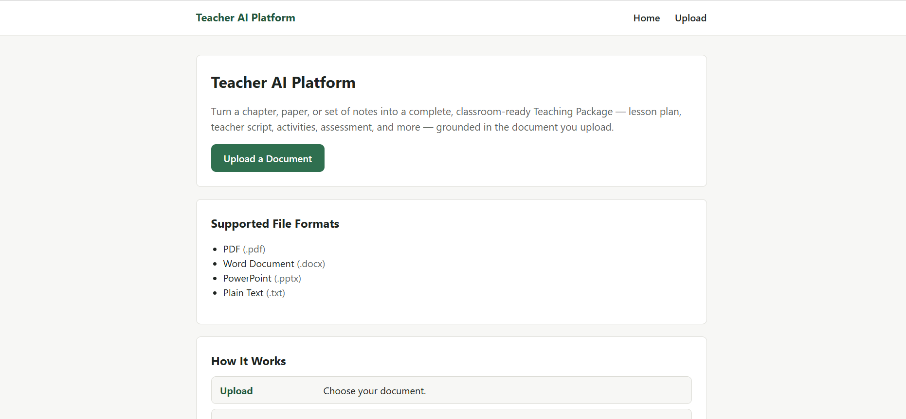
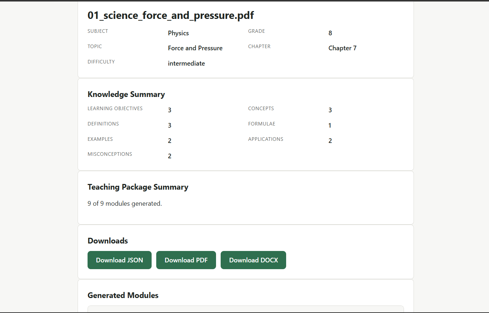

# Teacher AI Platform

An AI-powered system that turns a raw educational document — a textbook chapter, research paper, slide deck, or set of notes — into a complete, classroom-ready **Teaching Package**: a lesson plan, teacher script, activities, assessments, and more, all grounded in the source document. The platform includes a full retrieval-augmented generation (RAG) pipeline and a browser interface to upload documents, track generation progress in real time, and download the results.

## Live Demo

🔗 **[https://teacher-ai-platform-jjss.onrender.com/]**

## Table of Contents

- [Project Overview](#project-overview)
- [Features](#features)
- [Architecture](#architecture)
- [Technology Stack](#technology-stack)
- [Folder Structure](#folder-structure)
- [Installation](#installation)
- [Environment Variables](#environment-variables)
- [Running Locally](#running-locally)
- [Running Tests](#running-tests)
- [API Endpoints](#api-endpoints)
- [Screenshots](#screenshots)
- [Sample Inputs](#sample-inputs)
- [Example Workflow](#example-workflow)
- [Teaching Package Modules](#teaching-package-modules)
- [Current Limitations](#current-limitations)
- [Future Improvements](#future-improvements)

## Project Overview

A teacher uploads a PDF, DOCX, PPTX, or TXT document. The backend parses the file into a structured representation, chunks it in a hierarchy-aware way, embeds the chunks with Google Gemini embeddings, and indexes them in a ChromaDB vector store. A retrieval layer then feeds relevant context into two LLM-driven stages: **Educational Classification** (subject, grade, topic, chapter, difficulty) and **Knowledge Extraction** (objectives, concepts, definitions, formulae, examples, misconceptions). The extracted knowledge JSON is passed to a teaching-package orchestrator that runs nine independent content generators to assemble a complete instructional package.

The browser interface exposes this pipeline end to end: file upload, live progress tracking, a results view with collapsible module cards, and one-click downloads in JSON, PDF, or DOCX format.

## Features

- Upload PDF, DOCX, PPTX, or TXT documents
- Automatic educational classification (subject, grade, topic, chapter, difficulty)
- Structured knowledge extraction grounded in the source document
- Nine-module teaching package generation, from lesson plan to teacher guidance
- Retrieval-augmented generation over a Gemini-embedded, ChromaDB-indexed document store
- Real-time progress tracking via polling and Server-Sent Events, backed by an actual background job
- Server-rendered browser UI: Home, Upload, Progress, Results, Error, and 404 pages
- Download the generated package as JSON, PDF, or DOCX
- Independent module generation — a failure in one module does not block the rest of the package
- Friendly, non-technical error handling with no stack traces surfaced to the user

## Architecture

```
Upload
  ↓
Input Router
  ↓
Parser (PDF / DOCX / PPTX / TXT)
  ↓
StructuredDocument
  ↓
Educational Chunker (hierarchy-aware)
  ↓
Gemini Embeddings
  ↓
ChromaDB (vector store)
  ↓
Retriever
  ↓
Educational Classification  →  DocumentMetadata
  ↓
Knowledge Extraction        →  KnowledgeJSON
  ↓
Teaching Package Orchestrator
  ├─ Lesson Planner        ├─ Assessment
  ├─ Entry Ticket          ├─ Exit Ticket
  ├─ Teacher Script        ├─ Homework
  ├─ Blackboard Notes      └─ Teacher Guidance
  └─ Classroom Activity
  ↓
TeachingPackage → persisted as JSON in data/outputs/{document_id}.json
  ↓
Browser UI (Jinja2 + vanilla JS) → JSON / PDF / DOCX download
```

Ingestion and teaching-package generation run inside a FastAPI `BackgroundTask` after `/api/v1/upload` returns, so the browser can poll `/api/v1/progress/{job_id}` for live stage and percentage updates instead of blocking on a single long-running request.

## Technology Stack

| Layer | Choice |
|---|---|
| Language | Python 3.10+ |
| Backend Framework | FastAPI |
| Frontend | Jinja2 templates, vanilla JavaScript, plain CSS |
| LLM | Google Gemini (via `google-genai`) |
| Orchestration | LangChain |
| Vector Database | ChromaDB |
| Document Parsing | PyMuPDF, python-docx, python-pptx |
| Document Export | PyMuPDF (PDF), python-docx (DOCX) |
| Testing | pytest, httpx, Starlette TestClient |
| Deployment | Uvicorn (ASGI), Render-ready via `Procfile` |

## Folder Structure

```
app/
  main.py                     FastAPI app: routers, static mount, exception handlers
  config.py                   Settings (env-driven, via pydantic-settings)
  logging_config.py           Logging setup
  core/                       Exceptions, enums/constants (JobStage, etc.)
  web/                        Server-rendered page routes (Home/Upload/Progress/Results/Error)
  input_router/                Routes uploaded files to the correct parser
  parsers/                    PDF / DOCX / PPTX / TXT → StructuredDocument
  document_intelligence/      StructuredDocument, Section, Table, Image models
  chunking/                   Hierarchy-aware chunker
  embeddings/                 Gemini embedding provider
  vectorstore/                ChromaDB wrapper
  retriever/                  Query API over the vector store
  llm/                        Gemini structured-JSON text-generation client
  prompt_engine/              Loads and renders prompts/*.md templates
  classification/             Educational classification → DocumentMetadata
  knowledge_extraction/       Knowledge extraction → KnowledgeJSON
  teaching_package/           Nine generators + orchestrator + persistence
  progress/                   In-memory job progress tracker
  validation/                 Cross-cutting validation checks
  ingestion_service.py        Orchestrates router → chunk → embed → index → classify → extract
  api/routes/                 upload, progress, teaching_package, export, health
  models/schemas.py           API request/response models
  utils/                      File-handling helpers and export_utils.py (PDF/DOCX rendering)
templates/                    Jinja2 page templates
static/css/, static/js/       Plain CSS and vanilla JavaScript
prompts/                      Versioned prompt templates for classification, knowledge
                               extraction, and the nine generators
tests/                        pytest suite (unit and integration)
assets/
  screenshots/                Application screenshots for this README
  sample_inputs/              Example PDF, PPTX, and DOCX files for testing the live demo
data/uploads/, data/chroma_db/, data/outputs/   Runtime storage (gitignored)
```

## Installation

Requires **Python 3.10+**.

```bash
python3 -m venv .venv
source .venv/bin/activate          # Windows: .venv\Scripts\activate
pip install --upgrade pip
pip install -r requirements.txt

cp .env.example .env
# edit .env and set GOOGLE_API_KEY (free key: https://aistudio.google.com/app/apikey)
```

## Environment Variables

Configuration is centralized in `app/config.py` via `pydantic-settings` and loaded from a `.env` file. Key variables include:

| Variable | Purpose | Default |
|---|---|---|
| `GOOGLE_API_KEY` | Gemini API key for embeddings and text generation | *(required)* |
| `GEMINI_EMBEDDING_MODEL` | Embedding model used for chunk indexing | `gemini-embedding-001` |
| `GEMINI_GENERATION_MODEL` | Text generation model for classification, extraction, and content generation | `gemini-2.5-flash` |
| `CHROMA_COLLECTION_NAME` | ChromaDB collection name | `teacher_knowledge_chunks` |
| `MAX_UPLOAD_SIZE_MB` | Maximum accepted upload size | `50` |
| `ALLOWED_EXTENSIONS` | File types accepted by the uploader | `.pdf, .docx, .pptx, .txt` |
| `CHUNK_MAX_TOKENS` | Maximum tokens per chunk | `450` |
| `LOG_LEVEL` | Application log level | `INFO` |

See `.env.example` for the full, authoritative list of variables and their defaults, including chunking, retrieval, and generation parameters.

## Running Locally

```bash
uvicorn app.main:app --reload
```

- Browser UI: `http://127.0.0.1:8000/`
- Interactive API docs (Swagger): `http://127.0.0.1:8000/docs`

## Running Tests

```bash
./scripts/run_tests.sh
# or
pytest -v
```

Tests that depend on an unavailable package in your environment (`fitz`, `fastapi`, `chromadb`) are automatically skipped via `pytest.importorskip`, rather than being silently faked.

## API Endpoints

| Method | Path | Purpose |
|--------|------|---------|
| GET | `/api/v1/health` | Health check |
| POST | `/api/v1/upload` | Upload a PDF/DOCX/PPTX/TXT file; runs the pipeline in the background and returns a `job_id` immediately |
| GET | `/api/v1/progress/{job_id}` | Poll job progress (stage, percentage, and, once complete, the full result) |
| GET | `/api/v1/progress/{job_id}/stream` | Server-Sent-Events progress stream |
| POST | `/api/v1/retrieve` | Query the vector store for relevant chunks |
| GET | `/api/v1/teaching-package/{document_id}` | Fetch the persisted teaching package |
| GET | `/api/v1/export/{document_id}/json` | Download the full persisted bundle as JSON |
| GET | `/api/v1/export/{document_id}/pdf` | Download the teaching package as a PDF |
| GET | `/api/v1/export/{document_id}/docx` | Download the teaching package as a DOCX |

## Screenshots

**Home Page**



**Results Page**



## Sample Inputs

Ready-to-use example files are provided in `assets/sample_inputs/` so you can try the live application without preparing your own document:

- `sample_chapter.pdf` — a sample textbook chapter
- `sample_slides.pptx` — a sample slide deck
- `sample_notes.docx` — a sample set of notes

Download any of these files and upload them through the **Upload** page of the live application to see the full pipeline — classification, knowledge extraction, and teaching package generation — run end to end.

## Example Workflow

1. Open the live application (or run it locally) and go to the **Upload** page.
2. Select a document — or use one of the files from `assets/sample_inputs/`.
3. Submit the upload; the app redirects to the **Progress** page and polls `/api/v1/progress/{job_id}` for live status.
4. Once processing completes, the app redirects automatically to the **Results** page, showing document metadata, a knowledge summary, and each generated module in a collapsible card.
5. Download the full teaching package as JSON, PDF, or DOCX using the buttons on the Results page.

## Teaching Package Modules

Nine modules are generated per document: **Lesson Plan**, **Entry Ticket**, **Teacher Script**, **Blackboard Notes**, **Classroom Activity**, **Assessment**, **Exit Ticket**, **Homework**, and **Teacher Guidance**. Each module is generated independently, so a failure in one module does not block the rest of the package (failures are recorded in `generation_errors` in the persisted bundle).

### Export Formats

The three download endpoints read the already-persisted bundle (`DocumentMetadata` + `KnowledgeJSON` + `TeachingPackage`) written during upload — they do not re-invoke the AI pipeline:

- **JSON** — the full raw bundle, as-persisted
- **DOCX** — rendered with `python-docx`
- **PDF** — rendered with PyMuPDF (`fitz`)

Both formats are built from one shared set of formatted sections (`app/utils/export_utils.py`), so the two outputs stay consistent with each other.

## Current Limitations

- Single-process, in-memory job tracking — progress state is lost on restart and does not scale across multiple workers
- No authentication or user accounts
- No persistent database — each teaching package bundle is stored as a single JSON file under `data/outputs/`
- ChromaDB runs as local on-disk storage rather than a managed/hosted instance
- Export PDFs and DOCX files use simple, text-first layouts rather than branded templates
- If teaching package generation fails for a module, that module is omitted from the result

## Future Improvements

- Multi-agent orchestration with explicit role separation
- RAG citation and traceability surfaced directly on the Results page
- Curriculum alignment tagging (CBSE / ICSE / Common Core)
- Caching and batching of Gemini calls to reduce cost and latency
- A durable job store (Redis or SQL) in place of the in-memory tracker
- Authentication and per-user document history
- Richer, branded PDF/DOCX export templates

## License

No license file is currently included; all rights reserved by the author unless a license is added.